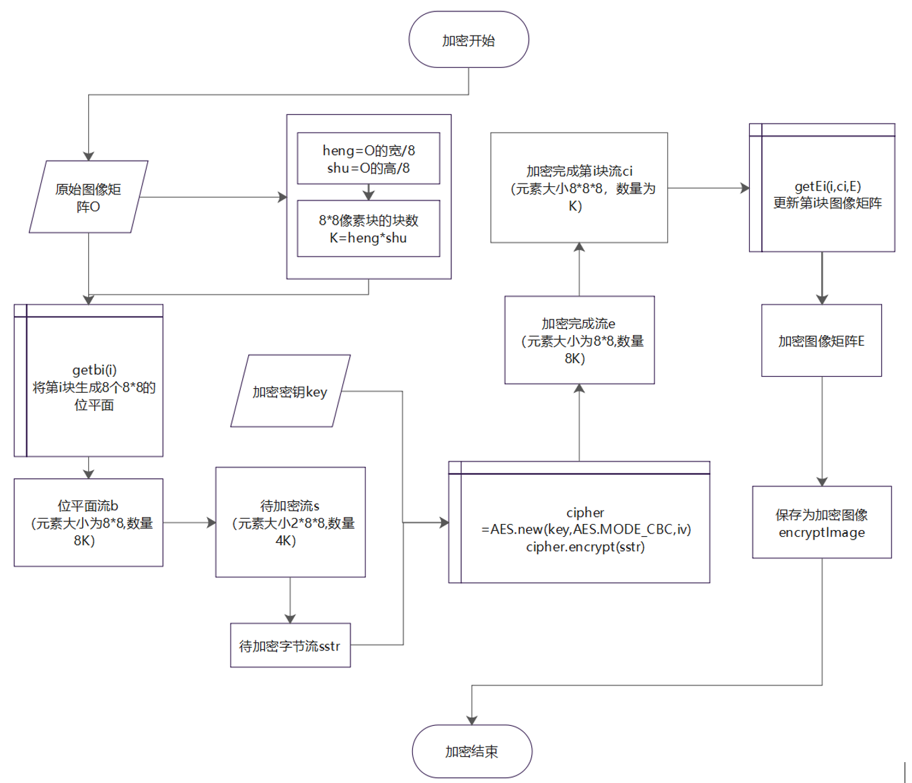
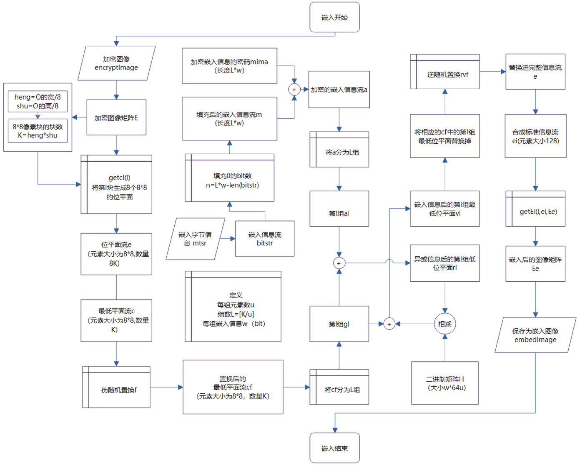
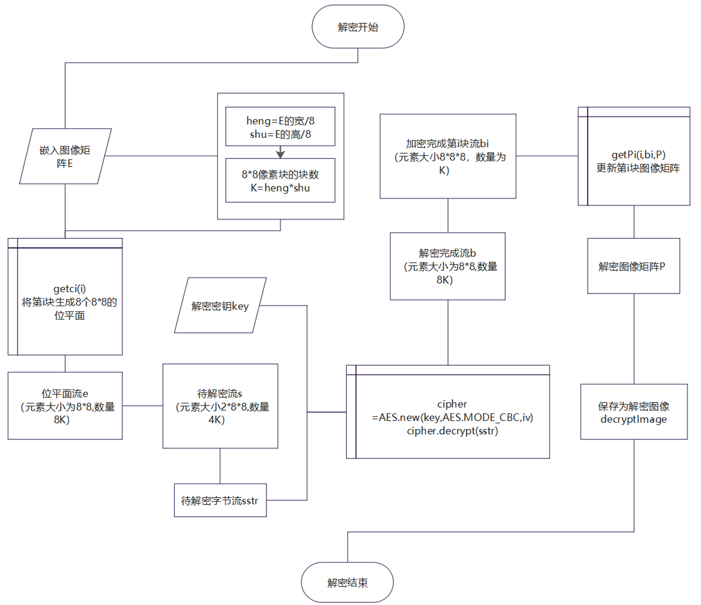
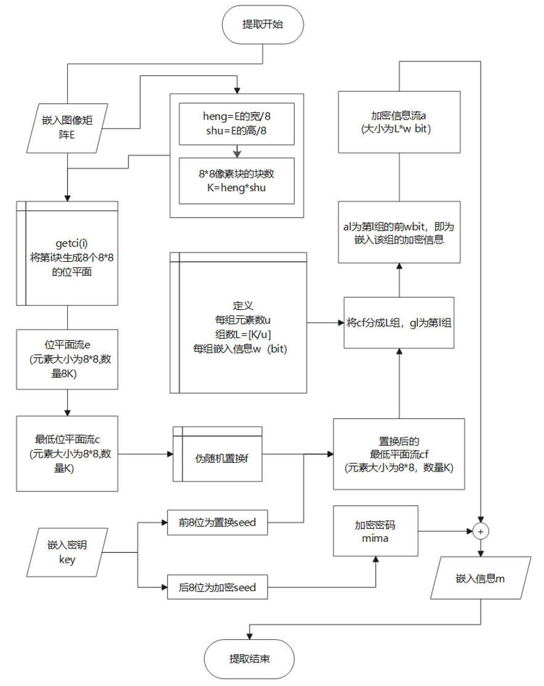
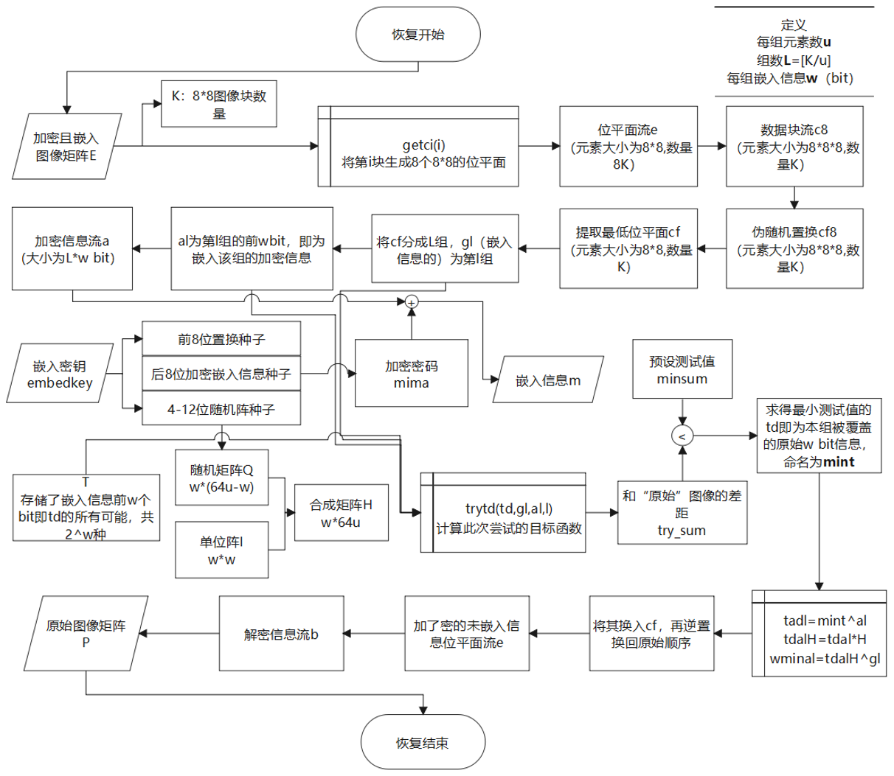
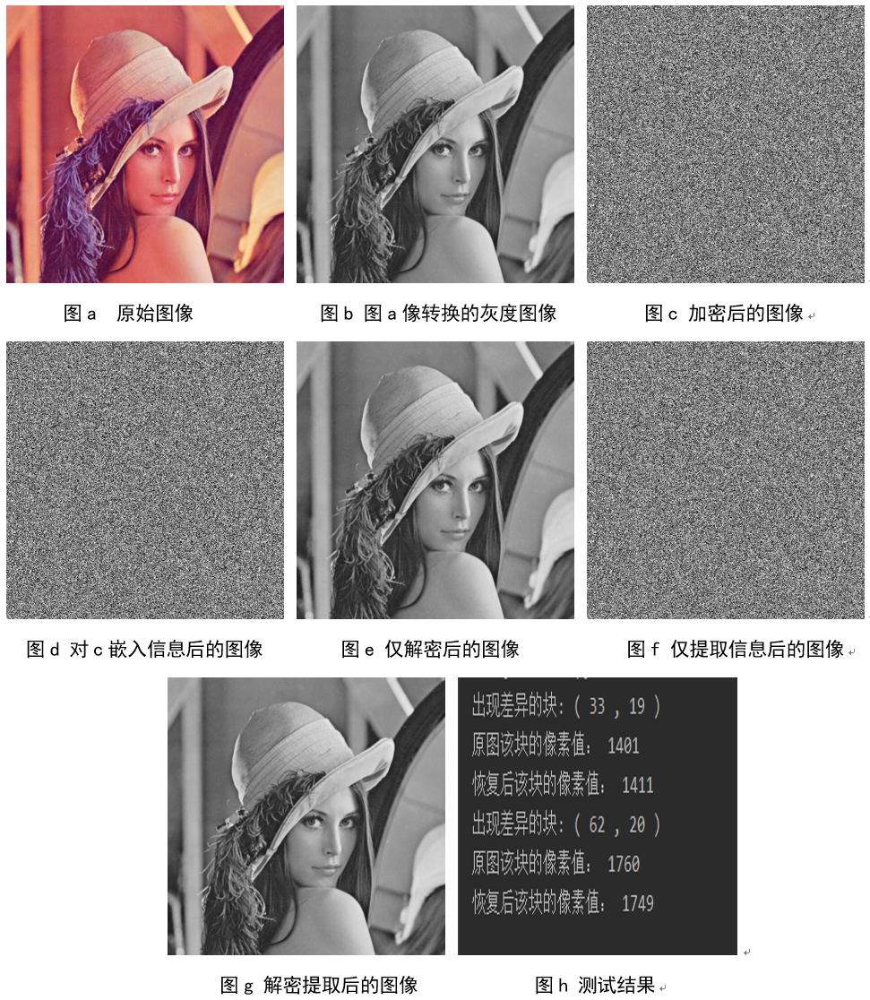

# 图像加密解密算法复现

### 复现文献

Zhenxing Qian, Xinpeng Zhang, Yanli Ren, Guorui Feng: Block cipher based separable reversible data hiding in encrypted images. Multim. Tools Appl. 75(21): 13749-13763 (2016)

链接：https://link.springer.com/article/10.1007%2Fs11042-015-2760-9

### 算法解析

该算法整体思路是通过位平面和分块加密，嵌入信息，并且能够实现可以提取信息而不解密图像，不提取信息解密图像，以及同时获取信息和图像。

恢复图像原理是通过图像平整度去判定是否恢复到原图像，所以对于某些特殊图像，无法完全复现出原本图像。

### 算法流程

#### 加密算法

#### 嵌入算法

#### 解密算法

#### 提取算法

#### 恢复（解密+提取）算法

### 最终效果

### 备注

只在png格式上测试过，其他的应该也可以。

这个算法针对灰度图像。
